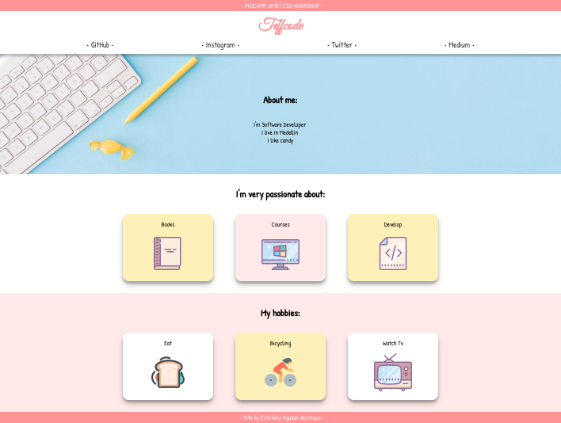
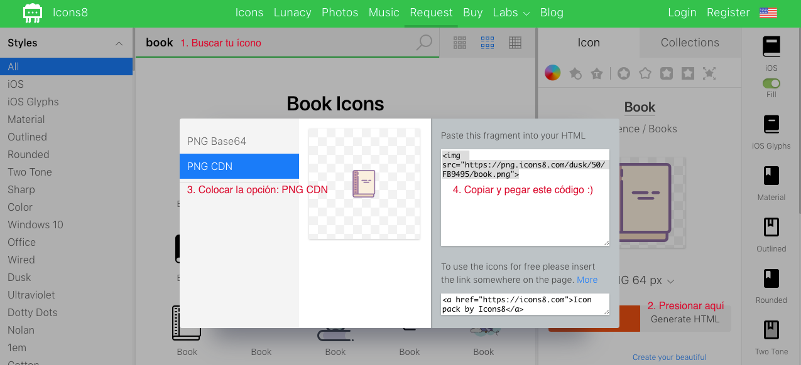

# 🧡 PIOCAMP 2018 | Taller de CSS desde cero 🧡

Hola Pionera !!! Desde ya me siento muy orgullosa de ti por tener esas ganas de aprender y esa linda dedicación. Esas son piezas fundamentales para ser una excelente desarrolladora. ¡ Sique así 😃 !

## ¿ Qué haremos ?

Haremos una página web sobre nosotras mismas 😊

## ¿ Qué aprenderemos ?

Aprenderemos sobre:
* Maquetación 
* Flexbox
* CSS Grid

## ¿ Qué debemos hacer para comenzar ?

1. Leer unas guías sobre Flexbox y CSSGrid.
2. Jugar para poder aplicar lo leído.
3. Clonar este repositorio.
4. Leer el paso a paso de este taller.

Ahora siiiii, ¿ estás lista ? 

¡ Empecémos !

# 💜 Mi primera página web con HTML y CSS 💜

### Tabla de contenidos:
1. [Guías sobre Flexbox y CSS Grid](#1-guías-sobre-flexbox-y-css-grid)
2. [Juegos sobre Flexbox y CSS Grid](#2-juegos-sobre-flexbox-y-css-grid)
3. [Después de clonar el repositorio...](#3-después-de-clonar-el-repositorio)
4. [Conozcamos la estructura de nuestra página web](#4-conozcamos-la-estructura-de-nuestra-página-web)
5. [Header](#5-header)
6. [Navbar](#6-navbar)
7. [About me - Section](#7-about-me---section)
8. [Tech - Section](#8-tech--section)
9. [Hobbies - Section](#9-hobbies---section)
10. [Footer](#10-footer)

## 1. Guías sobre Flexbox y CSS Grid

Unas guías que siempre me han salvado la vida y que hoy te quiero compartir, son:

* https://css-tricks.com/snippets/css/a-guide-to-flexbox/
* https://css-tricks.com/snippets/css/complete-guide-grid/

Espero te gusten y te sean útiles, no solo para hoy sino para el futuro.

## 2. Juegos sobre Flexbox y CSS Grid

Aquí te dejo los siguientes links para que juguemos un ratico:

* https://flexboxfroggy.com/#es
* https://cssgridgarden.com/#es

## 3. Después de clonar el repositorio...

Después de clonar el repositorio encontrarás dos carpetas: inicial y final. Tú comenzarás a escribir código en el `index.html` que dejé para ti en la carpeta inicial. Y porsupuesto, en la carpeta final está el resultado al que debemos llegar.

Para correr tu página, debes ir al navegador y poner la ruta en la que se encuentra tu proyecto. un ejemplo sería:

`file:///Users/user/Documents/PIOCAMP/workshop-css/inicial/index.html`

## 4. Conozcamos la estructura de nuestra página web

Aquí te muestro el resultado final de nuestra página !!! Eso sí, puedes escoger los colores, fotos y fuentes que más te gusten 🤗 

Encontrarás un header, un navbar, tres secciones y un footer. ¡ Trata de identifícalos !



## 5. Header

En nuestro HTML colocaremos lo siguiente:

```
<header>• PIOCAMP 2018 | CSS WORKSHOP •</header>
```

Y, en nuestro CSS:

```
header {
    background-color: #FB9495;
    color: white;
    padding: 4px;
    position: fixed;
    text-align: center;
    width: 100%;
    z-index: 3;            
}
```

## 6. Navbar 

En nuestro HTML colocaremos lo siguiente:

```
<nav>
    <div class="nav-bottom">
        <h1> TU_NOMBRE_AQUÍ </h1>
    </div>
</nav>
```

Y, en nuestro CSS:

```
nav {
    background-color: white;
    box-shadow: 0 6px 6px rgba(0,0,0,0.23);
    padding-bottom: 10px;
    position: fixed;
    width: 100%;
    z-index: 2;
}
```

El CSS de `h1` sería:

```
.nav-bottom h1 {
    color: #FB9495;
    font-family: 'Great Vibes', cursive;
    font-size: 40px;
    margin-top: 40px;
    margin-bottom: 10px;
    text-align: center;
}
```

Debajo del `h1` pondremos una lista con nuestras redes sociales, algo así:

```
<ul>
    <li><a href="">• GitHub •</a></li>
    <li><a href="">• Instagram •</a></li>
    <li><a href="">• Twitter •</a></li>
    <li><a href="">• Medium •</a></li>
</ul>
```

y en el CSS:

```
.nav-bottom  ul { 
    display: flex;
    font-size: 20px;
    justify-content: space-evenly;
    list-style-type: none;
    margin: 0;
    padding: 0;
}

.nav-bottom a {
    color: #333;
    text-decoration: none;
}

.nav-bottom a:hover {
    color: #FB9495;
}
```

## 7. About me - Section

```
<section class="about-me-section text-center">
    <h2>About me:</h2>
    <p>
        I'm Software Developer <br/> 
        I live in Medellín <br/> 
        I like candy 
    </p>
</section>
```
CSS:

text-center será una clase que usaremos mucho para centrar nuestros textos ! 

```
.text-center {
    text-align: center;
}
```
y `about-me-section` sería:

```
.about-me-section {
    align-items: center;
    background-image: url('./assets/about-me.jpg');
    background-position: right bottom;
    background-size: cover;
    display: flex;
    flex-direction: column;
    height: 380px;
    justify-content: flex-end;
    padding-bottom: 60px;
    width: 100%;
}
```

## 8. Tech- Section

Icons8: https://icons8.com/ 



```
<section class="tech-section text-center">
    <h2>I'm very passionate about:</h2>
    <div class="tech-section-books card">
        <p>Books</p>
        
    </div>
    <div class="tech-section-courses card">
        <p>Courses</p>
        
    </div>
    <div class="tech-section-develop card">
        <p>Develop</p>
        
    </div>
</section>
```
CSS:
```
.tech-section {
    background-color: white;
    display: grid;
    grid-template-columns: repeat(5, 1fr);
    grid-template-rows: 100px auto;
    height: 300px;
    width: 100%;
}
.tech-section  h2 {
    grid-column: 2 / 5;
    line-height: 2.5;
}
.tech-section-books {
    background-color: #FDF1B2;
    grid-column: 2 / 3;
}
.tech-section-courses {
    background-color: #FEEAE9;
    grid-column: 3 / 4;
}
.tech-section-develop {
    background-color: #FDF1B2;
    grid-column: 4 / 5;
}
```

## 9. Hobbies - Section

Esta sección es muy similar a la anterior. Así que, ¡ trata de hacerla ! Si tienes dudas, pregúntanos 😉

## 10. Footer

HTML:

```
<footer>• Site by TU_NOMBRE_AQUÍ •</footer>
```
CSS:
```
footer {
    background-color: #FB9495;
    color: white;
    padding: 4px;
    text-align: center;
    width: 100%;
}
```